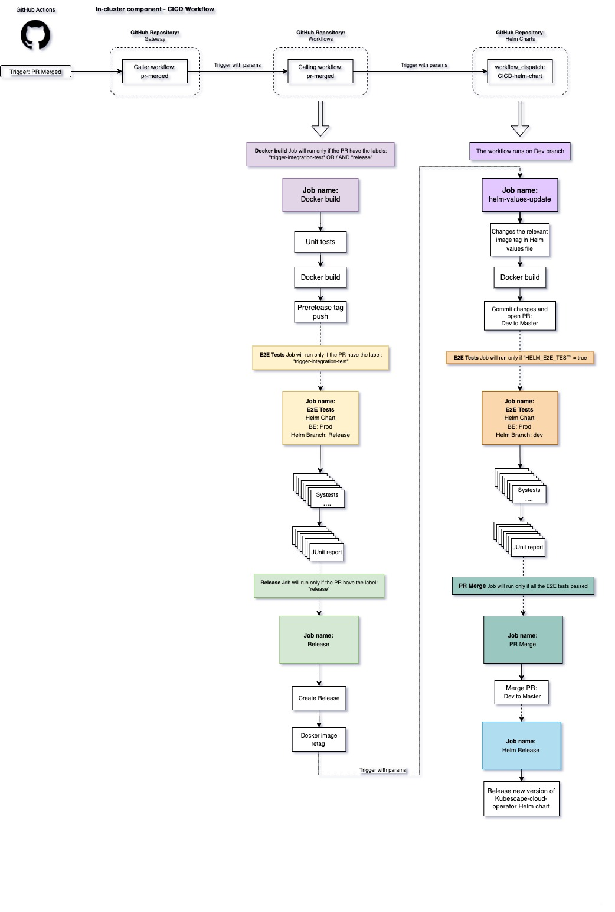

# In-cluster component workflow docs


So you finished your work and want to create a PR from your branch into the “master” branch, how to use our CICD? what going to happen and how things will work behind the scene? 

I'm going to describe here all the steps.

### Open a new PR

In the first step, you need to decide if you want to run integration tests and create a release from your PR, you need to add the relevant label for that according to the following options:
* If you decided only to run integration tests, add the label “trigger-integration-test”
* If you decided to create a release, add the label “release”
* If you decided to run integration tests AND create a release, add both “trigger-integration-test” and “release” labels
* If you don’t want to run tests and don’t want to create a release, DO NOT add the labels mentioned above.

**You can add the labels before or after the PR creation.**

In the next step, after creating a PR from your branch to the "master" branch, the “pull_request_created” will run and scan your code for
* Scan for vulnerabilities.
* Scan for credentials.
* Scan for open-source licenses. 
* Run unit tests 
* Build your code
* Comment the results into your PR.

If you will push another commit while the “pull_request_created” workflow is running, a new workflow will launch, and the previous workflow that scans your old commit will be automatically canceled.

**Note: “pull_request_created” will run only when the target will be the “master” branch.**

### Merging the PR

When your PR will be merged into the “master” branch, the “build” workflow will run according to the labels that you added.

***The order of all steps and actions in each of them are arranged in chronological order, if one of the steps or actions fails, the entire workflow will stop and will not continue to the next step.***

### Step 1: Build (“trigger-integration-test” OR “release” labels added).

In step 1, the workflow will:
* Run unit tests.
* Build a docker image and tag it with the build number and ```-prerelease``` suffix. (Example: ```quay.io/kubescape/operator:v0.1.2-prerelease```)
* Push the docker image in the relevant “quay.io” docker repository.
* Sign the docker image with the “Cosign” tool.

### Step 2: integration tests (“trigger-integration-test” label added)

In step 2, the workflow runs the relevant systests for every component using the new image that built in the previous step.
The tests will be according to the list in the “pr-merged.yaml” workflow file that sits under the path: ```.github/workflows/pr-merged.yaml```.
All the tests will run as parallel jobs against our production environments, a JUnit report will be generated for every test with the final results.

### Step 3: Create a release (“release” label added).

In step 3, the workflow will:

* Retag the docker image for “latest” and create a new tag without the ```-prerelease``` suffix.
* Create a GitHub release.
* Trigger another job (Helm chart CICD) as ```workflow_dispatch``` and will pass the required parameters and arguments.

### Step 4: Helm chart CICD.

As I mentioned before, the previous job has triggered the Helm chart CICD workflow that will run in the ```kubescape/helm-charts``` repo and ```dev``` branch. 
The Helm chart CICD will:
* Update the new tag of the specific component in the helm values file
* Bump the chart version
* Commit new changes to ```dev``` branch.
* Create a new PR from the ```dev``` branch to the ```master``` branch.
* Run E2E tests (```helm-branch: dev```)
* Merge the PR
* Create a new helm release

### A draw of the flow:


## Available Workflows

Here's the list of reusable workflows available from this repository:

| **Name**            | **Variables**                                                | **Description**                                              |
| ------------------- | ------------------------------------------------------------ | ------------------------------------------------------------ |
| `sanity-check.yaml` | -  `SYSTEM_TESTS_BRANCH`: define alternative branch to clone for [system-tests](github.com/armosec/system-tests) repository. Default: `master`<br />- `BINARY_TESTS`: specify which tests are going to be executed by the workflow. | This workflow allow you to run **system-tests** in the **production** environment |
